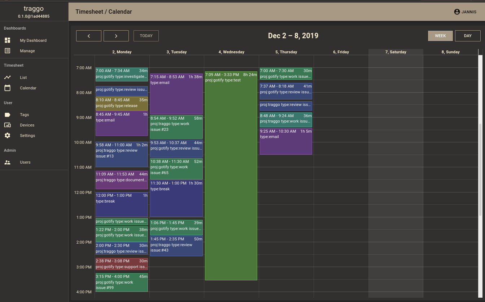

<!--
Важно: этот README был автоматически сгенерирован <https://github.com/YunoHost/apps/tree/master/tools/readme_generator>
Он НЕ ДОЛЖЕН редактироваться вручную.
-->

# Traggo для YunoHost

[](https://ci-apps.yunohost.org/ci/apps/traggo/)  

[](https://install-app.yunohost.org/?app=traggo)

*[Прочтите этот README на других языках.](./ALL_README.md)*

> *Этот пакет позволяет Вам установить Traggo быстро и просто на YunoHost-сервер.*  
> *Если у Вас нет YunoHost, пожалуйста, посмотрите [инструкцию](https://yunohost.org/install), чтобы узнать, как установить его.*

## Обзор

Traggo is a tag-based time tracking tool. In Traggo there are no tasks, only tagged time spans. With tags, Traggo tries to be as customizable as possible, for example if you work on different projects you could add a project-tag. If you like to see statistics from the different things you do, you could add a type-tag with values like email, programming, meeting.

### Features

- Easy to setup
- Time tracking (obviously)
- Customizable dashboards with diagrams
- A list and calendar view of the tracked time
- Sleek web ui with multiple themes
- Simple user management


**Поставляемая версия:** 0.6.0~ynh1

## Снимки экрана



## Документация и ресурсы

- Официальный веб-сайт приложения: <https://traggo.net>
- Официальная документация администратора: <https://traggo.net/config/>
- Репозиторий кода главной ветки приложения: <https://github.com/traggo/server>
- Магазин YunoHost: <https://apps.yunohost.org/app/traggo>
- Сообщите об ошибке: <https://github.com/YunoHost-Apps/traggo_ynh/issues>

## Информация для разработчиков

Пришлите Ваш запрос на слияние в [ветку `testing`](https://github.com/YunoHost-Apps/traggo_ynh/tree/testing).

Чтобы попробовать ветку `testing`, пожалуйста, сделайте что-то вроде этого:

```bash
sudo yunohost app install https://github.com/YunoHost-Apps/traggo_ynh/tree/testing --debug
или
sudo yunohost app upgrade traggo -u https://github.com/YunoHost-Apps/traggo_ynh/tree/testing --debug
```

**Больше информации о пакетировании приложений:** <https://yunohost.org/packaging_apps>
